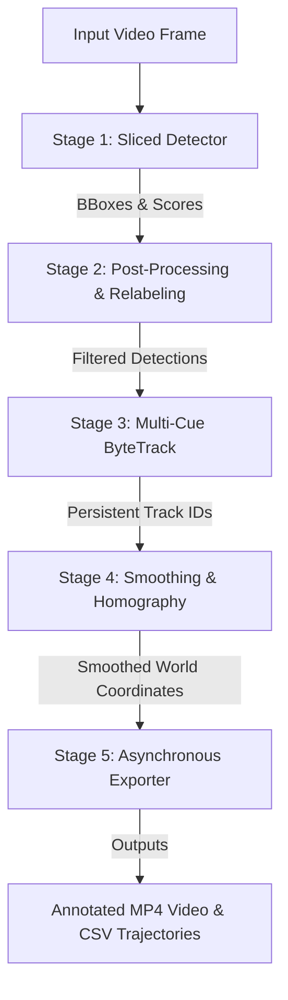

# Contributor Guide: Traffic Detection, Tracking, and Safety Analysis Pipeline

Welcome to the **Traffic Detection, Tracking, and Safety Analysis Pipeline** contributor guide! This document is designed to onboard new developers and researchers from scratch to end. By reading this guide, you will understand the architecture, implementation details, mathematical concepts, and guidelines for contributing to this project.

---

## Table of Contents

1. [Project Overview](#1-project-overview)
2. [System Architecture & Core Pipeline](#2-system-architecture--core-pipeline)
   - [Stage 1: Sliced Object Detection](#stage-1-sliced-object-detection)
   - [Stage 2: Geometrical Post-Processing & Relabeling](#stage-2-geometrical-post-processing--relabeling)
   - [Stage 3: Multi-Cue Tracking](#stage-3-multi-cue-tracking)
   - [Stage 4: Trajectory Smoothing & Coordinate Mapping](#stage-4-trajectory-smoothing--coordinate-mapping)
   - [Stage 5: Asynchronous Exporter & Diagnostics](#stage-5-asynchronous-exporter--diagnostics)
3. [Safety Analysis Rules Engine](#3-safety-analysis-rules-engine)
4. [Codebase Directory Structure](#4-codebase-directory-structure)
5. [Installation & Setup](#5-installation--setup)
6. [Developer Workflows (CLI Guide)](#6-developer-workflows-cli-guide)
7. [Guidelines for New Contributions](#7-guidelines-for-new-contributions)
   - [Adding a New Detector Backend](#adding-a-new-detector-backend)
   - [Creating a New Safety Rule](#creating-a-new-safety-rule)
   - [Coding Standards & Pull Request Checklist](#coding-standards--pull-request-checklist)

---

## 1. Project Overview

This project is a modular computer vision and analytics pipeline optimized for drone-captured video footage of congested Indian intersections. Drone footage brings unique challenges such as:
- **Dense, Heterogeneous Traffic**: Dozens of road users of varying scales (pedestrians, motorcycles, cars, auto-rickshaws, buses, trucks) sharing space without strict lane discipline.
- **Small-Object Footprints**: Distant vehicles or small motorcycles may occupy only a few pixels (e.g., $15 \times 8$ px), making traditional detectors fail.
- **Downstream Surrogate Safety Analysis**: The end goal is to output highly accurate, mathematically smooth trajectories and metric velocities to evaluate intersection safety indices, such as Time-to-Collision (TTC) or Post-Encroachment Time (PET).

The repository decouples the computer vision tracking pipeline (which runs heavy neural network models to produce a structured CSV of trajectories) from the safety-rules engine (which parses the CSV to flag traffic violations or conflict events).

---

## 2. System Architecture & Core Pipeline

The video tracking pipeline processes frames sequentially through five decoupled stages:



### Stage 1: Sliced Object Detection
* **Files**: [detection.py](file:///d:/btp/Traffic_Object_Detection_and_Tracking/src/detection.py), [sahi_dino_detection.py](file:///d:/btp/Traffic_Object_Detection_and_Tracking/src/sahi_dino_detection.py), [sahi_rtdetr_detection.py](file:///d:/btp/Traffic_Object_Detection_and_Tracking/src/sahi_rtdetr_detection.py), [tiling.py](file:///d:/btp/Traffic_Object_Detection_and_Tracking/src/tiling.py), [sahi_fusion.py](file:///d:/btp/Traffic_Object_Detection_and_Tracking/src/sahi_fusion.py)
* **Concept**: Instead of downsampling high-resolution drone footage (which destroys small objects), the frame is split into overlapping tiles (e.g., $512 \times 512$ or $640 \times 640$ grid) with a $20\%-35\%$ overlap.
* **Backends**:
  - **YOLOv8** (CNN-based anchor-free model)
  - **RT-DETRv2-X** ("DINO" detector): Incorporates Deformable Self-Attention and Contrastive Denoising (CDN) mechanics. It reduces tile-to-tile confidence score variance, which improves tracking stability.
* **Deduplication (Weighted Box Fusion)**: Detections falling in overlapping tile boundaries are grouped by class and center-point proximity. Lower-confidence duplicates are suppressed if their Intersection-over-Union (IoU) with the group anchor exceeds a threshold ($0.35$).

### Stage 2: Geometrical Post-Processing & Relabeling
* **File**: [postprocess_vehicle_classes.py](file:///d:/btp/Traffic_Object_Detection_and_Tracking/src/postprocess_vehicle_classes.py)
* **Concept**: Deep learning models often associate absolute bounding-box area with class tags. From high-altitude drone footage, cars are small and are frequently mislabeled as motorcycles, or large SUVs are mislabeled as trucks.
* **Constraints**:
  - **Car-to-Motorcycle Downgrade**: If a `car` bounding-box length is less than $32.0$ pixels, it is geometrically impossible to be a car based on scale. It is reassigned to `motorcycle`.
  - **Truck-to-Car Downgrade**: Heavy trucks are rare in standard city intersection footage. Large vehicle detections flagged as `truck` (Class 7) are overridden to `car` (Class 2) to maintain a clean four-class taxonomy (Person, Car, Motorcycle, Bus).

### Stage 3: Multi-Cue Tracking
* **Files**: [tracker.py](file:///d:/btp/Traffic_Object_Detection_and_Tracking/src/tracker.py), [reid.py](file:///d:/btp/Traffic_Object_Detection_and_Tracking/src/reid.py)
* **Concept**: A custom ByteTrack framework combined with Kalman filtering and deep visual appearance descriptors.
* **Tracking Features (The 10-Layer Logic)**:
  1. **Distance-IoU (DIoU) Assignment**: Penalizes center-point displacement in the Hungarian matching cost matrix to prevent overlapping vehicles from stealing track IDs.
  2. **Tri-Modal Appearance Extraction**: Extracting a 128-dimensional Cosine embedding from a ResNet50 backbone combined with a 512-dimensional HSV Color Histogram, blended temporally via Exponential Moving Average (EMA).
  3. **Fused Cost Matrix**: Cost = $0.4 \times (1 - \text{DIoU}) + 0.2 \times \text{Cost}_{\text{motion}} + 0.4 \times \text{Distance}_{\text{appearance}}$.
  4. **Class-Specific Kalman Physics**: Adapts the process noise covariance matrix ($Q$) based on agility (e.g., higher variance for agile motorcycles, low variance for high-momentum buses).
  5. **Adaptive Measurement Noise**: Exponentially increases Kalman measurement noise covariance ($R$) when detector confidence drops, forcing the filter to rely on velocity vectors rather than jittery detections.
  6. **Adaptive Track Buffering**: Long-lived tracks receive up to $2 \times$ longer frame buffers to survive heavy occlusions.
  7. **Observation-Centric Online Smoothing (OOS)**: Upon track reconnection after a gap, the drifted Kalman state is mathematically repaired using actual visual velocities.
  8. **Observation-Centric Recovery (OCR)**: Spatial searches are anchored on the *last valid visual observation* rather than drifted Kalman prediction rays.
  9. **Active Track Deduplication**: Runs a final IoU check ($0.65$) on active tracks to cull duplicates on tile-stitching boundaries.
  10. **Nascent ID Switch Repair**: Retroactively merges new short tracks with recently lost tracks of the same class if they are spatially and visually identical.

### Stage 4: Trajectory Smoothing & Coordinate Mapping
* **Files**: [smoothing.py](file:///d:/btp/Traffic_Object_Detection_and_Tracking/src/smoothing.py), [homography.py](file:///d:/btp/Traffic_Object_Detection_and_Tracking/src/homography.py)
* **Trajectory Smoothing**: Sub-pixel detection oscillation is smoothed using a $7$-frame Moving Average low-pass filter. This removes high-frequency jitter and stabilizes derivative velocity calculations.
* **Coordinate Mapping**: Maps 2D pixel coordinates to metric coordinates (meters):
  - **Scale Factor Method**: Perfect for strictly top-down (Nadir) camera angles. $\text{Scale} = \text{Real Length (m)} / \text{Pixel Length (px)}$.
  - **Homography Matrix Method**: Resolves perspective tilt (e.g., $15^{\circ}$ camera tilt) using a $3 \times 3$ perspective transformation matrix ($H$) calibrated from Ground Control Points (GCPs).
* **Velocity Estimation**: Calculated using the Euclidean distance difference between consecutive frames multiplied by the video Frame Rate (FPS).

### Stage 5: Asynchronous Exporter & Diagnostics
* **Files**: [export.py](file:///d:/btp/Traffic_Object_Detection_and_Tracking/src/export.py), [diagnostics.py](file:///d:/btp/Traffic_Object_Detection_and_Tracking/src/diagnostics.py)
* **Asynchronous Output Rendering**: Video encoding is written using a background daemon thread that consumes a frame queue. This decouples file I/O from tracking logic and boosts pipeline throughput.
* **Track Diagnostics**: Automatically scans trajectories for gaps. If a track drops or suffers fragmentation, the pipeline crops and exports a $3$-second failure clip to `outputs/debug/motorcycle_failures/` for diagnostic inspection.

---

## 3. Safety Analysis Rules Engine

Once the tracking pipeline writes the trajectory metrics to a CSV, the safety-rules engine can ingest the file to flag traffic violations. The parameters (e.g., center coordinates, inner/outer radii) are defined in [calibration.py](file:///d:/btp/Traffic_Object_Detection_and_Tracking/src/safety/calibration.py).

The safety engine implements several standalone rules:

| Rule | Location | Target Behavior | Core Math/Logic |
|---|---|---|---|
| **Wrong-Way Driving** | [wrong_way_rule.py](file:///d:/btp/Traffic_Object_Detection_and_Tracking/src/safety/wrong_way_rule.py) | Vehicles moving clockwise inside a counter-clockwise roundabout. | Polar coordinate conversion. Angular velocity $\omega < -0.1$ rad/s persisting for $\ge 30$ consecutive frames. |
| **Tailgating / Proximity** | [safe_space_rule.py](file:///d:/btp/Traffic_Object_Detection_and_Tracking/src/safety/safe_space_rule.py) | Following too closely behind another vehicle in the same lane. | Arc-length gap $d = \frac{r_j + r_i}{2} \times \Delta\theta_{\text{wrapped}} < 4.0$ meters while the follower speed exceeds $1.0$ m/s. |
| **Unsafe Overtaking** | [unsafe_overtaking_rule.py](file:///d:/btp/Traffic_Object_Detection_and_Tracking/src/safety/unsafe_overtaking_rule.py) | Passing a same-lane vehicle with dangerously close lateral spacing. | Angular coordinate cross-over sign changes. Computes relative longitudinal coordinate (`forward` dot product) and lateral deviation (`lateral` cross product) within a restricted zone. |
| **Unsafe Roundabout Shortcut** | [unsafe_roundabout_shortcut_rule.py](file:///d:/btp/Traffic_Object_Detection_and_Tracking/src/safety/unsafe_roundabout_shortcut_rule.py) | Cutting corners (e.g., turning right directly clockwise). | Computes total unwrapped angular trajectory change. If entry/exit directions belong to shortcut paths (e.g., North-to-West, South-to-East) and total angular change is $< 150^{\circ}$ during congestion, a violation is flagged. |

---

## 4. Codebase Directory Structure

```
Traffic_Object_Detection_and_Tracking/
├── docs/                                  # Component-specific documentation
│   ├── 1_detection.md                     # Detection mechanics (SAHI, RT-DETR)
│   ├── 2_tracking.md                      # Kalman physics & tracking cost matrices
│   ├── 3_postprocessing.md                # Trajectory smoothing & category mapping
│   ├── 4_homography.md                    # Coordinates homography math
│   ├── 5_export.md                        # Asynchronous video output & schemas
│   ├── SAHI_DINO_SETUP.md                 # Setup for DINO detector backend
│   ├── approach.md                        # Algorithmic design decisions comparison
│   └── safety_rules/                      # Technical documentation of safety rules
├── src/                                   # Source code directory
│   ├── main.py                            # Pipeline Entry Point CLI
│   ├── detection.py                       # Detector wrapper for YOLOv8 (Tiling)
│   ├── sahi_dino_detection.py             # Detector wrapper for RT-DETRv2-X (SAHI+WBF)
│   ├── sahi_rtdetr_detection.py           # Detector wrapper for RT-DETR-L (SAHI+NMS)
│   ├── sahi_fusion.py                     # Weighted Box Fusion (WBF) implementation
│   ├── tiling.py                          # Tile grid calculation & baseline NMS
│   ├── tracker.py                         # ByteTrack & STrack Kalman filtering
│   ├── reid.py                            # Tri-modal embedding extractor (ResNet50 + HSV)
│   ├── smoothing.py                       # Rolling Moving Average low-pass filter
│   ├── homography.py                      # Homography coordinates matrix mappings
│   ├── postprocess_vehicle_classes.py     # Class correction and taxonomy filters
│   ├── export.py                          # Multi-threaded VideoWriter & CSV exporter
│   ├── diagnostics.py                     # Unsupervised track error & gap detection
│   ├── compare_detectors.py               # Comparative benchmarking CLI
│   ├── tune_sahi_dino.py                  # Detector parameters grid search
│   ├── finetune_motorcycles.py            # Focal Loss fine-tuning script
│   ├── utils.py                           # Logging & path helpers
│   └── safety/                            # Safety Engine and Rules
│       ├── calibration.py                 # Geometric configuration variables
│       ├── interactive_calibration.py     # GUI script to measure pixel coordinates
│       ├── zone.py                        # Intersection zone inclusion logic
│       ├── wrong_way_rule.py              # Wrong-way driving evaluation script
│       ├── unsafe_roundabout_shortcut_rule.py # Shortcut right-turn detection
│       ├── safe_space_rule.py             # Tailgating / proximity evaluation
│       ├── rules_explanation.md           # Equations & formulas explanation
│       └── visualizations/                # Plottings & video rendering utilities
│           ├── visualize_violations.py
│           ├── visualize_unsafe_overtaking_plot.py
│           ├── visualize_shortcut_violations.py
│           └── wrong_way_v.py
├── requirements.txt                       # Primary Python dependencies
└── README.md                              # General project overview
```

---

## 5. Installation & Setup

Ensure you have **Python 3.10+** and a CUDA-capable GPU (highly recommended for deep learning inference).

### 1. Set Up a Virtual Environment
```bash
# Windows
python -m venv venv
venv\Scripts\activate

# Linux/Mac
python3 -m venv venv
source venv/bin/activate
```

### 2. Install Dependencies
```bash
pip install --upgrade pip
pip install -r requirements.txt
```

### 3. Verify CUDA Availability
```bash
python -c "import torch; print('CUDA Available:', torch.cuda.is_available())"
```

### 4. Fetch Deep Learning Model Weights
Model weights are automatically downloaded to your local cache by the Ultralytics API on the first pipeline execution. If you need to pre-download them:
```bash
# Downloads RT-DETRv2-X (DINO Backend)
python -c "from ultralytics import RTDETR; RTDETR('rtdetr-x.pt')"

# Downloads YOLOv8m (Baseline Backend)
python -c "from ultralytics import YOLO; YOLO('yolov8m.pt')"
```

---

## 6. Developer Workflows (CLI Guide)

### Running the Tracking Pipeline
To process a video file and output an annotated video along with coordinates trajectories:

```bash
# 1. Run using DINO-style RT-DETRv2-X detector (Recommended)
python src/main.py \
    --input data/video/intersection.mp4 \
    --detector sahi_dino \
    --model rtdetr-x.pt \
    --slice-height 640 \
    --slice-width 640 \
    --device cuda

# 2. Run using standard YOLOv8m detector
python src/main.py \
    --input data/video/intersection.mp4 \
    --detector yolov8 \
    --model yolov8m.pt \
    --imgsz 1280 \
    --device cuda
```

### Optimizing Detector Hyperparameters
Run a grid-search to find the optimal combination of tile slice size, overlap ratios, and confidence thresholds:
```bash
python src/tune_sahi_dino.py \
    --video data/video/intersection.mp4 \
    --model rtdetr-x.pt \
    --device cuda \
    --max-frames 200
```

### Evaluating Safety Rules
Ingest the trajectory CSV generated by the main pipeline to check for safety violations:

```bash
# 1. Run the tailgating safe space rule analyzer
python src/safety/safe_space_rule.py \
    --csv outputs/csv/intersection_tracks.csv \
    --output src/safety/csv_outputs/tailgating_violations.csv

# 2. Run the Wrong-Way analyzer
python src/safety/wrong_way_rule.py \
    --csv outputs/csv/intersection_tracks.csv \
    --output src/safety/csv_outputs/wrong_way_violations.csv

# 3. Run the Roundabout Shortcut analyzer
python src/safety/unsafe_roundabout_shortcut_rule.py \
    --csv outputs/csv/intersection_tracks.csv \
    --output src/safety/csv_outputs/shortcut_violations.csv
```

### Visualizing Violations
To render diagnostic plots or videos highlighting where rule violations occurred:
```bash
python src/safety/visualizations/visualize_violations.py \
    --csv outputs/csv/intersection_tracks.csv \
    --violations src/safety/csv_outputs/safe_space_violations.csv \
    --video data/video/intersection.mp4 \
    --output outputs/video/violations_visualized.mp4
```

---

## 7. Guidelines for New Contributions

We welcome contributions that improve object detection recall, tracking coherence, and safety analysis algorithms.

### Adding a New Detector Backend
If you want to integrate a new detector model family (e.g., YOLOv10, Grounding DINO):
1. **Interface Contract**: Create a new wrapper file or add a class inside `src/` that implements the `detect` method. It must accept a single BGR image (numpy array) and return a list of dictionaries with this schema:
   ```python
   [
       {
           "bbox": [x1, y1, x2, y2],  # floats in absolute pixels
           "confidence": float,       # value in [0.0, 1.0]
           "class_id": int,           # COCO class integer
           "class_name": str          # class label
       },
       ...
   ]
   ```
2. **Integration**: Register your detector backend in [main.py](file:///d:/btp/Traffic_Object_Detection_and_Tracking/src/main.py)'s CLI options:
   - Update `build_parser()` choices for the `--detector` argument.
   - Instantiation logic: search for `# Initialize detector` inside `main.py` and map your CLI key to your detector class.

### Creating a New Safety Rule
To implement a new safety rule (e.g., Lane-Change frequency, Pedestrian-Encroachment):
1. **Script Template**: Create a standalone python file in [src/safety/](file:///d:/btp/Traffic_Object_Detection_and_Tracking/src/safety/). It should be executable via command-line arguments:
   ```python
   if __name__ == "__main__":
       import argparse
       parser = argparse.ArgumentParser(description="Evaluate <Rule Name>")
       parser.add_argument("--csv", type=str, required=True, help="Input CSV tracks file")
       parser.add_argument("--output", type=str, default="...", help="Output CSV path")
       args = parser.parse_args()
       evaluate_rule(args.csv, args.output)
   ```
2. **Tabular Output Design**: Make sure violations are written into a structured CSV so that visualization tools can ingest them. Include keys such as `violation_type`, `frame`, `track_id`, `lane`, and any metric parameters (like distance or deceleration rate).
3. **Documentation**: Add your rule's mathematical formula, parameters, and pseudocode to the [rules_explanation.md](file:///d:/btp/Traffic_Object_Detection_and_Tracking/src/safety/rules_explanation.md).

### Coding Standards & Pull Request Checklist
- **Coding Conventions**: All new code should adhere to PEP 8 style standards. Use type annotations on all function signatures.
- **Maintain Comments**: Do not strip existing docstrings or inline comments. Keep mathematical justifications in the comments where relevant.
- **Paths**: Always use relative paths when looking up default data files or fallback configurations (using `Path(__file__).parent` patterns) so that code executes uniformly on other environments.
- **Unit Checks**: Verify your additions by running standard validation clips:
  - Verify detection metrics (number of tracks extracted).
  - Confirm the exporter does not drop below expected FPS targets.
  - Run existing safety scripts to ensure they are backward-compatible.
- **PR Documentation**: Summarize any changes to hyperparameters or model weights in your Pull Request description, detailing the quantitative impact on tracking precision or ID switches.
