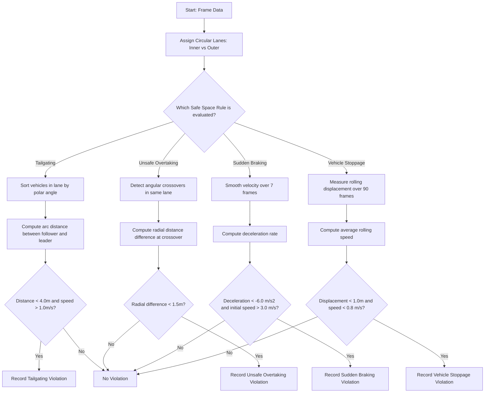

# Safe Space Evaluation Rules Documentation

This document details the algorithm, mathematical formulations, and code implementations of the **Safe Space Evaluation Rules** used in the traffic tracking pipeline, including Tailgating (Proximity Violation), Unsafe Overtaking, Sudden Braking, and Vehicle Stoppage.

---

## 1. Geometric & Calibration Framework
All distance and speed calculations are performed in metric coordinates (meters, meters per second) derived dynamically from pixel space using the centralized calibration settings:

$$\text{SCALE} = \frac{\text{LANE\_WIDTH\_M}}{\text{LANE\_WIDTH\_PX}} = \frac{7.0}{85.0} \approx 0.082353 \text{ m/px}$$

| Boundary | Pixel Coordinate | Metric Radius (meters) | Description |
| :--- | :--- | :--- | :--- |
| **Inner boundary ($R_{\text{INNER}}$)** | $120.0 \text{ px}$ | $9.8824 \text{ m}$ | Inner island circle limit. |
| **Lane separator ($R_{\text{SEPARATOR}}$)**| $200.0 \text{ px}$ | $16.4706 \text{ m}$ | Boundary separating Inner & Outer circulatory lanes. |
| **Outer boundary ($R_{\text{OUTER}}$)** | $280.0 \text{ px}$ | $23.0588 \text{ m}$ | Outer roundabout boundary limit. |

Lanes are assigned dynamically based on the vehicle's radial distance $r_i$ from the center $(X_C, Y_C)$:
```python
def assign_lane(r):
    if R_INNER <= r < R_SEPARATOR:
        return 'Inner'
    elif R_SEPARATOR <= r <= R_OUTER:
        return 'Outer'
    return 'None'
```

---

## 2. Tailgating (Proximity Violation)

### A. Context & Description
Tailgating occurs when a vehicle follows the vehicle ahead of it too closely, leaving an unsafe distance. In case of sudden deceleration, a rear-end collision is highly likely.

### B. Mathematical Formulation
To calculate the distance between two vehicles in a circular lane at a specific frame:
1. All vehicles in the same lane (`Inner` or `Outer`) at the same frame are grouped.
2. They are sorted by their polar angle $\theta_i \in (-\pi, \pi]$ relative to the center.
3. For a follower vehicle $A$ and its adjacent leader vehicle $B$ (where $B$ is ahead of $A$ in the angular order):
   * **Angular separation ($\Delta\theta$)** (modulo $2\pi$ to account for boundary wrapping):
     $$\Delta\theta = (\theta_B - \theta_A) \pmod{2\pi}$$
   * **Mean circular radius ($R_{\text{avg}}$)**:
     $$R_{\text{avg}} = \frac{r_A + r_B}{2}$$
   * **Circular Arc Distance ($d$)**:
     $$d = R_{\text{avg}} \times \Delta\theta$$
4. A violation is flagged if:
   $$d < 4.0\text{ meters} \quad \text{and} \quad v_A > 1.0\text{ m/s}$$

### C. Implementation Snippet
```python
# Group frame-by-frame, then by lane
for (frame, lane), group in ring_df.groupby(['frame', 'lane']):
    if len(group) < 2:
        continue
    
    # Sort vehicles by polar angle theta to find follower-leader order
    sorted_group = group.sort_values('theta').to_dict('records')
    n = len(sorted_group)
    
    for i in range(n):
        follower = sorted_group[i]
        leader = sorted_group[(i + 1) % n]  # Wraps around to form a closed ring
        
        # Calculate circular angle difference modulo 2*pi
        delta_theta = (leader['theta'] - follower['theta']) % (2 * np.pi)
        
        # Arc length formula: d = radius * delta_theta
        d = ((leader['r'] + follower['r']) / 2) * delta_theta
        
        # Apply threshold criteria (proximity < 4m, speed > 1m/s to ignore queues)
        if d < 4.0 and follower['velocity_ms'] > 1.0:
            tailgating_records.append({
                'frame': frame,
                'follower_track_id': follower['track_id'],
                'leader_track_id': leader['track_id'],
                'lane': lane,
                'd': d,
                'class_name': follower['class_name']
            })
```

---

## 3. Unsafe Overtaking

### A. Context & Description
Unsafe overtaking is defined as passing another vehicle in the same circular lane with an lateral buffer zone of $< 1.5$ meters at the moment of crossover.

### B. Mathematical Formulation
For any vehicle $A$ overtaking vehicle $B$:
1. **Crossover frame** is identified when vehicle $A$ passes vehicle $B$'s angular position ($\theta_A$ crosses $\theta_B$).
2. The lateral distance difference at crossover is computed as:
   $$d_{\text{lateral}} = |r_A - r_B|$$
3. A violation is flagged if:
   $$d_{\text{lateral}} < 1.5\text{ meters}$$

---

## 4. Sudden Braking

### A. Context & Description
Sudden braking violations capture high deceleration rates indicative of panic stops, conflicts, or near-miss incidents.

### B. Mathematical Formulation
1. **Smoothed Velocity**: A 7-frame rolling average filters high-frequency tracking noise:
   $$v_{\text{smooth}, i} = \frac{1}{7} \sum_{k=0}^{6} v_{i-k}$$
2. **Acceleration**: Deceleration rate is computed using the smoothed difference scaled by frame rate:
   $$a_i = (v_{\text{smooth}, i} - v_{\text{smooth}, i-1}) \times \text{FPS}$$
3. A violation is flagged if:
   $$a_i < -6.0\text{ m/s}^2 \quad \text{and} \quad v_{\text{smooth}, i-1} > 3.0\text{ m/s}$$

---

## 5. Vehicle Stoppage

### A. Context & Description
Vehicles parking, stopping, or breaking down in active roundabout lanes creates significant safety hazards and bottlenecks.

### B. Mathematical Formulation
Over a rolling 90-frame window (3.0 seconds at 30 FPS):
1. **Displacement**: Total physical movement from the start of the window is calculated:
   $$d_{\text{displacement}} = \sqrt{(x_i - x_{i-90})^2 + (y_i - y_{i-90})^2}$$
2. **Window Velocity**: Mean velocity during the window is computed:
   $$\bar{v} = \frac{1}{90} \sum_{k=0}^{89} v_{i-k}$$
3. A violation is flagged if:
   $$d_{\text{displacement}} < 1.0\text{ meter} \quad \text{and} \quad \bar{v} < 0.8\text{ m/s}$$

---

## 6. Safe Space Evaluation Flowchart


