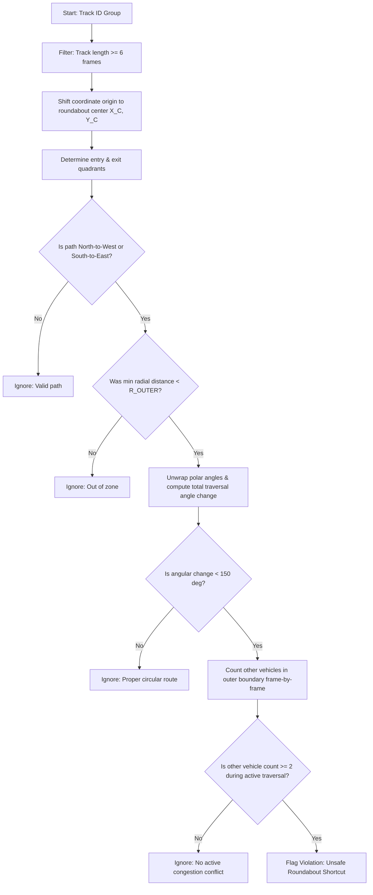

# Unsafe Roundabout Shortcut Rule Documentation

This document explains the mathematical formulas, physical parameters, and code implementation of the **Unsafe Roundabout Shortcut Rule** used in this project.

---

## 1. Physical Context & Rule Description
Roundabouts are designed to slow down vehicles and channel them through a circular path around a central island. A major safety violation occurs when a right-turning vehicle **cuts across the corner** (traveling counter-clockwise/wrong-way through a short arc) instead of navigating clockwise around the central island.

### Physical Constraints & Shortcuts:
* **East & West Arms**: Protected by concrete medians that extend close to the central island, preventing right-turning vehicles from cutting the corner.
* **North & South Arms**: Do not have concrete medians. Drivers can exploit this to perform dangerous, wrong-way corner-cut right turns:
  * **North $\rightarrow$ West**
  * **South $\rightarrow$ East**

### Shortcut Definition:
> A vehicle is flagged for an **unsafe roundabout shortcut** if it transitions from North to West or South to East, enters the roundabout boundary, has a low cumulative angular traversal ($\Delta\theta < 150^\circ$), and does so during congested traffic (at least 2 other active vehicles inside the outer boundary).

---

## 2. Geometric & Mathematical Calibration
All physical parameters are dynamically derived from original pixel measurements and scaled using the centralized calibration factor:

$$\text{SCALE} = \frac{\text{LANE\_WIDTH\_M}}{\text{LANE\_WIDTH\_PX}} = \frac{7.0}{85.0} \approx 0.082353 \text{ m/px}$$

| Parameter | Original Pixels | Metric Value (meters) | Description |
| :--- | :--- | :--- | :--- |
| **Roundabout Center ($X_C$)** | $870 \text{ px}$ | $71.7647 \text{ m}$ | Center X coordinate of the island. |
| **Roundabout Center ($Y_C$)** | $570 \text{ px}$ | $46.9412 \text{ m}$ | Center Y coordinate of the island. |
| **Inner Radius ($R_{\text{INNER}}$)** | $120 \text{ px}$ | $9.8824 \text{ m}$ | Radius of the central circular island. |
| **Outer Radius ($R_{\text{OUTER}}$)** | $280 \text{ px}$ | $23.0588 \text{ m}$ | Radius of the outer boundary approach zone. |

### A. Phase-Unwrapped Angular Traversal
For any vehicle position $(x_i, y_i)$ at frame $i$, we compute its coordinates relative to the roundabout center:
$$dx_i = x_i - X_C$$
$$dy_i = y_i - Y_C$$

Its polar angle $\theta_i$ is computed using the multi-quadrant arctangent:
$$\theta_i = \text{arctan2}(dy_i, dx_i)$$

Since $\theta_i \in [-\pi, \pi]$, a vehicle circling the island will experience sudden jumps (from $\pi$ to $-\pi$). To calculate the true continuous trajectory angle, we **unwrap** the sequence of phase angles:
$$\theta_{\text{unwrapped}} = \text{unwrap}(\theta)$$

The absolute angular traversal ($\Delta\theta$) in degrees is given by:
$$\Delta\theta = |\theta_{\text{unwrapped}}[-1] - \theta_{\text{unwrapped}}[0]| \times \frac{180.0}{\pi}$$

* **Clockwise Loop (Proper Navigation)**: Traverses a long arc around the island $\Delta\theta \approx 270^\circ$.
* **Counter-Clockwise Cut (Illegal Shortcut)**: Cuts directly across the quadrant $\Delta\theta \approx 90^\circ$.
* **Threshold**: $\Delta\theta < 150^\circ$ is used to isolate the shortcut arc.

### B. Congestion Criterion
To prioritize safety conflicts, the rule is triggered during traffic congestion. For each frame of the target vehicle's path, we count the number of other vehicles whose radial distance from the center is within the outer circulatory boundary:
$$r_j = \sqrt{(x_j - X_C)^2 + (y_j - Y_C)^2} < R_{\text{OUTER}}$$

If this count is $\ge 2$ (excluding the target vehicle), the frame is flagged as a conflict frame.

---

## 3. Code Walkthrough
The rule is implemented in [`unsafe_roundabout_shortcut_rule.py`](file:///d:/btp/Traffic_Object_Detection_and_Tracking/src/safety/unsafe_roundabout_shortcut_rule.py).

### Step 1: Compass Direction Mapping
The quadrant mapping uses relative offsets to assign heading quadrants:
```python
def determine_direction(dx: float, dy: float) -> str:
    if abs(dx) >= abs(dy):
        return "EAST" if dx > 0 else "WEST"
    return "SOUTH" if dy > 0 else "NORTH"
```

### Step 2: Target Path Filtering
Vehicles are analyzed if they match vulnerable path directions:
```python
shortcut_paths = {("NORTH", "WEST"), ("SOUTH", "EAST")}

first = track.iloc[0]
last = track.iloc[-1]
entry_direction = determine_direction(first["dx"], first["dy"])
exit_direction = determine_direction(last["dx"], last["dy"])
```

### Step 3: Traversal Angle Assessment
```python
theta = np.arctan2(track["dy"], track["dx"])
theta_unwrapped = np.unwrap(theta)
total_angular_change = np.abs(theta_unwrapped[-1] - theta_unwrapped[0]) * 180.0 / np.pi

is_shortcut = False
if (entry_direction, exit_direction) in shortcut_paths:
    if total_angular_change < 150.0:
        is_shortcut = True
```

### Step 4: Frame Congestion Checking
```python
conflict_frames = []
for _, row in track.iterrows():
    same_frame = frame_groups[row["frame"]]
    other_vehicles = same_frame[same_frame["track_id"] != track_id]
    other_in_outer = (other_vehicles["r"] < R_OUTER).sum()
    if other_in_outer >= CONGESTION_THRESHOLD:
        conflict_frames.append(int(row["frame"]))
```

---

## 4. Flowchart of Rule Evaluation


